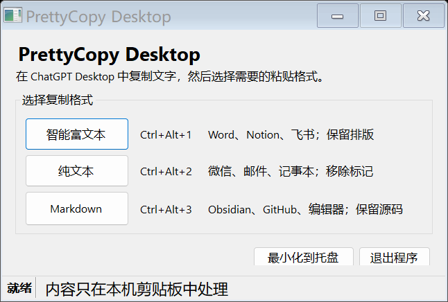

# PrettyCopy

PrettyCopy 解决一个很小但很烦的问题：从 AI 对话中复制文字后，粘贴到 Word、微信或 Markdown 编辑器时，格式经常不对。

项目包含两个版本：

- 浏览器扩展：为 ChatGPT 网页版增加复制按钮。
- Windows 桌面版：在 ChatGPT Desktop 或其他桌面应用中复制后，通过快捷键转换剪贴板格式。

转换完全在本机完成，不上传剪贴板或对话内容。



## 三种格式

| 模式 | 适合粘贴到 | 处理方式 |
| --- | --- | --- |
| 智能富文本 | Word、Notion、飞书、Outlook | 保留标题、列表、表格、链接和代码块 |
| 纯文本 | 微信、邮件、记事本 | 清理 Markdown 标记和多余空行 |
| Markdown | Obsidian、GitHub、编辑器 | 保留 Markdown 源码 |

## Windows 桌面版

从 [Releases](../../releases/latest) 下载 `PrettyCopyDesktop` 压缩包，解压后直接运行。程序常驻系统托盘，不需要管理员权限，也不会设置开机启动。

1. 在 ChatGPT Desktop 中按 `Ctrl+C`。
2. 按 `Ctrl+Alt+1`、`Ctrl+Alt+2` 或 `Ctrl+Alt+3` 转换格式。
3. 在目标应用中按 `Ctrl+V`。

窗口关闭后会缩到托盘。需要完全退出时，右键托盘图标并选择“退出”。

桌面版不会注入或修改 ChatGPT Desktop；它只处理 Windows 剪贴板，因此也能用于其他 AI 客户端和普通文本来源。

## 浏览器扩展

从 [Releases](../../releases/latest) 下载 `prettycopy` 扩展包并解压：

1. 打开 Chrome 的 `chrome://extensions`，或 Edge 的 `edge://extensions`。
2. 开启“开发者模式”。
3. 点击“加载已解压的扩展程序”，选择解压后的目录。
4. 刷新 ChatGPT 页面。

扩展只请求 `clipboardWrite` 和 `storage` 权限，页面访问范围限于 `chatgpt.com` 和旧版 `chat.openai.com`。

## 本地构建

浏览器扩展的检查需要 Node.js：

```powershell
npm run check
```

Windows 桌面版使用系统自带的 .NET Framework C# 编译器：

```powershell
.\desktop\build.ps1
.\desktop\dist\PrettyCopyDesktop.exe --self-test
```

## 项目结构

```text
src/                    浏览器扩展的转换与页面适配
popup/                  扩展设置界面
scripts/                检查和回归测试
desktop/                Windows 桌面版源码与构建脚本
manifest.json           Chrome/Edge Manifest V3 声明
```

## 已知限制

- ChatGPT 调整网页结构后，浏览器扩展的页面适配可能需要更新。
- 复杂公式、交互图表、附件和图片目前只做文本级处理。
- 部分只接受 RTF、不接受 HTML 剪贴板格式的旧应用，可能退回纯文本。

## 许可证

[MIT](LICENSE)
